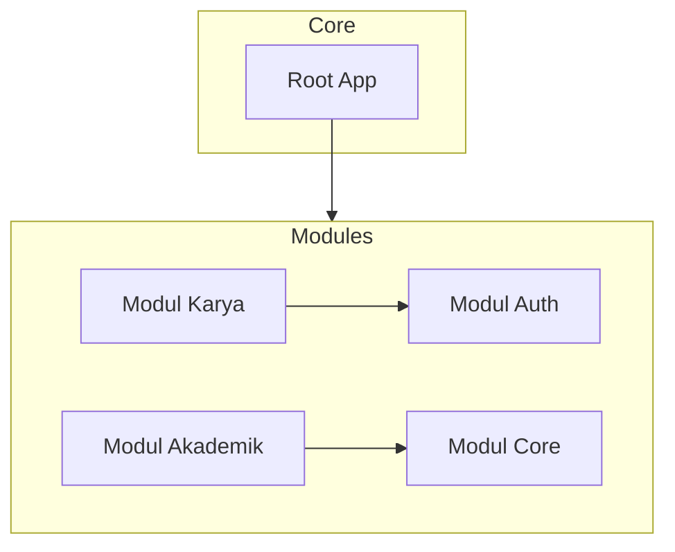

<div align="center">

# 🎓 Portal Karya TRPL SV IPB (PJBL-EUYY)
**Sistem Informasi Terpadu & Galeri Karya Mahasiswa Berbasis Modular Monolith**

[](https://laravel.com)
[](https://php.net)
[](https://tailwindcss.com/)
[](https://www.mysql.com/)

> *"Sebuah platform galeri karya mahasiswa, ulasan ulasan, manajemen berita prodi, dan konten akademik Sekolah Vokasi IPB University dengan arsitektur modern standar industri."*

</div>

---

## 🏛️ Arsitektur Sistem: Modular Monolith

Aplikasi ini menggunakan pola arsitektur **Modular Monolith** menggunakan package `nwidart/laravel-modules`. Pendekatan ini memisahkan sistem menjadi domain-domain independen (*modules*) untuk mempermudah pemeliharaan jangka panjang, skalabilitas tim, dan transisi ke microservices di masa mendatang jika diperlukan.



### 📦 Batasan Domain (Domain Boundaries)

1. **`Modules/Core`**: Mengelola halaman utama (*Home*), data profil program studi (*About*), FAQ, penjejakan pengunjung (*Visitor Logging*), *Activity Log*, serta halaman utama Dashboard Admin.
2. **`Modules/Auth`**: Mengelola otentikasi penuh sistem (Login, Register, Logout, Alur Reset Password via Email).
3. **`Modules/Karya`**: Mengatur pengajuan karya mahasiswa, ulasan & rating bintang, sistem validasi (moderasi accepted/rejected oleh admin), dan ekspor laporan.
4. **`Modules/Akademik`**: Mengelola data akademik seperti profil Dosen, kurikulum Mata Kuliah, dan artikel Berita/Kegiatan prodi.

---

## ✨ Fitur Utama & Keunggulan Teknikal

### 💎 Desain UI/UX Premium & Dark Mode
- Antarmuka interaktif menggunakan **Outfit & Inter** Google Fonts.
- Penerapan **Glassmorphism** dan **Micro-Animations** berbasis Tailwind CSS & Alpine.js.
- Fitur **Dark Mode** instan tanpa efek flash saat memuat halaman (*anti-flash script* di header).
- Integrasi PWA (Progressive Web App) dengan service worker (`sw.js`).

### 📊 Ekspor Laporan Excel Premium (PhpSpreadsheet)
- Modul Karya dan Visitor dilengkapi dengan fitur ekspor data otomatis ke Excel (.xlsx).
- Hasil ekspor dirancang secara premium: memiliki header institusi resmi, penyesuaian lebar kolom otomatis, pewarnaan status dinamis (*color-coded statuses*), dan baris bergantian warna (*zebra striping*).

### 🚀 Optimasi Performa Tingkat Lanjut
1. **Eager Loading (Pencegahan N+1 Query)**: Semua pemanggilan ulasan dan relasi model dioptimalkan menggunakan metode `with()` (contoh: pemuatan karya beserta ulasan dan data penggunanya pada Home dan Galeri).
2. **Query Caching**: Menggunakan `Cache::remember` dengan durasi caching dinamis untuk data statis seperti data Dosen, statistik karya, dan total statistik dashboard admin.
3. **Database Indexing**: Kolom pencarian kritis seperti `status_validasi`, `kategori`, dan `tahun` pada tabel `karyas` dioptimalkan dengan indeks database demi pencarian secepat kilat.
4. **Robust FormRequest Validation**: Seluruh aturan validasi dipisahkan dari Controller ke file Request khusus (seperti `StoreKaryaRequest`) untuk menjaga kebersihan logika controller.

---

## 🚀 Cara Instalasi & Menjalankan Lokal

Pastikan Anda memiliki **PHP >= 8.2**, **Composer >= 2.x**, **Node.js >= 18.x**, dan **MySQL** terinstal.

1. **Clone Repositori**
   ```bash
   git clone https://github.com/username/pjbl-euyy.git
   cd pjbl-euyy
   ```

2. **Instal Dependensi Backend & Frontend**
   ```bash
   composer install
   npm install
   ```

3. **Konfigurasi Environment**
   Salin file konfigurasi env dan atur kredensial database Anda:
   ```bash
   cp .env.example .env
   ```
   Buka file `.env` dan pastikan konfigurasi database sesuai:
   ```env
   DB_CONNECTION=mysql
   DB_HOST=127.0.0.1
   DB_PORT=3306
   DB_DATABASE=portaltpl
   DB_USERNAME=root
   DB_PASSWORD=
   ```

4. **Generate App Key & Migrasi Data**
   Jalankan migrasi database beserta penambahan indeks performa dan seed data awal:
   ```bash
   php artisan key:generate
   php artisan migrate --seed
   ```
   *(Penyedia data / Seeder akan otomatis membuatkan akun admin bawaan beserta contoh data dosen, kategori karya, dll).*

5. **Jalankan Server Lokal**
   Buka dua jendela terminal terpisah:
   ```bash
   # Terminal 1 (PHP Server)
   php artisan serve

   # Terminal 2 (Vite Server untuk CSS/JS)
   npm run dev
   ```
   Akses di browser Anda: `http://localhost:8000`

---

## 🧪 Pengujian Otomatis (Testing)

Proyek ini dilengkapi dengan suite pengujian otomatis tingkat fitur (Feature Tests) untuk memastikan integritas kode dan rute aman dari celah otorisasi:
```bash
php artisan test
```

Fitur yang diuji meliputi:
- Pembebanan halaman publik (Home, Dosen, Mata Kuliah, Galeri Karya).
- Hak akses berbasis peran (*Role-Based Access Control* / RBAC).
- Alur pengajuan karya dan validasi admin.
- Validasi fungsionalitas unduhan Laporan Excel (.xlsx).

---
<div align="center">
  <i>Dikembangkan dengan standar arsitektur bersih dan performa prima untuk Sekolah Vokasi IPB University.</i>
</div>