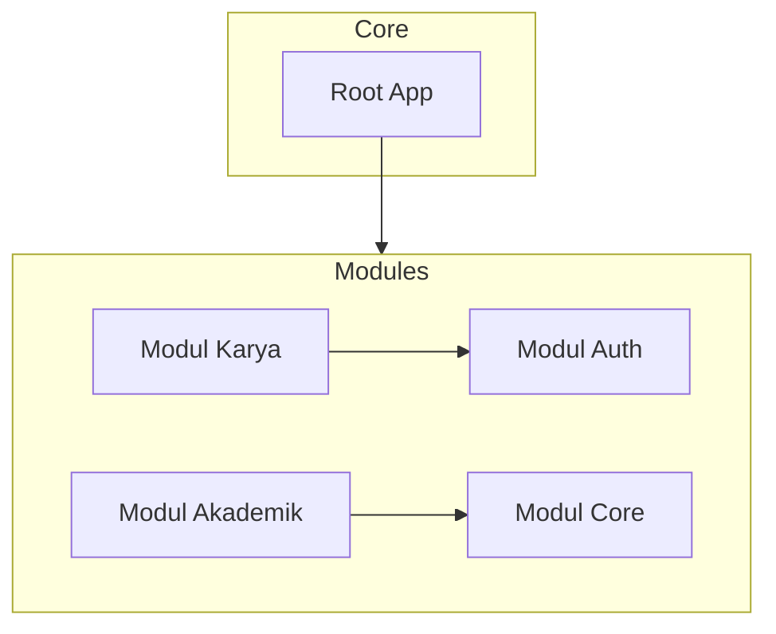

<div align="center">

# 🎓 Portal Karya TRPL SV IPB (portal-karya-tpl)
**Sistem Informasi Terpadu & Galeri Karya Mahasiswa Berbasis Modular Monolith**

[](https://laravel.com)
[](https://php.net)
[](https://tailwindcss.com/)
[](https://www.mysql.com/)

> *"Sebuah platform galeri karya mahasiswa, ulasan ulasan, manajemen berita prodi, dan konten akademik Sekolah Vokasi IPB University dengan arsitektur modern standar industri."*

</div>

---

## 🏛️ Arsitektur Sistem: Modular Monolith

Aplikasi ini menggunakan pola arsitektur **Modular Monolith** menggunakan package `nwidart/laravel-modules`. Pendekatan ini memisahkan sistem menjadi domain-domain independen (*modules*) untuk mempermudah pemeliharaan jangka panjang, skalabilitas tim, dan transisi ke microservices di masa mendatang jika diperlukan.



### 📦 Batasan Domain (Domain Boundaries)

1. **`Modules/Core`**: Mengelola halaman utama (*Home*), data profil program studi (*About*), FAQ, penjejakan pengunjung (*Visitor Logging*), *Activity Log*, serta halaman utama Dashboard Admin.
2. **`Modules/Auth`**: Mengelola otentikasi penuh sistem (Login, Register, Logout, Alur Reset Password via Email).
3. **`Modules/Karya`**: Mengatur pengajuan karya mahasiswa, ulasan & rating bintang, sistem validasi (moderasi accepted/rejected oleh admin), dan ekspor laporan.
4. **`Modules/Akademik`**: Mengelola data akademik seperti profil Dosen, kurikulum Mata Kuliah, dan artikel Berita/Kegiatan prodi.

---

## ✨ Fitur Utama & Keunggulan Teknikal

### 💎 Desain UI/UX Premium & Dark Mode
- Antarmuka interaktif menggunakan **Outfit & Inter** Google Fonts.
- Penerapan **Glassmorphism** dan **Micro-Animations** berbasis Tailwind CSS & Alpine.js.
- Fitur **Dark Mode** instan tanpa efek flash saat memuat halaman (*anti-flash script* di header).
- Integrasi PWA (Progressive Web App) dengan service worker (`sw.js`).

### 🔍 Pencarian Instan FAQ (Alpine.js - Client-Side)
- Pencarian pertanyaan dan jawaban secara langsung (*zero-latency text filtering*) menggunakan Alpine.js.
- Mempertahankan HTML statis ter-render dari server untuk menjamin **SEO indexing** tetap prima, berbeda dengan SPA konvensional.
- Dilengkapi dengan *empty state* / pesan "Tidak ada hasil ditemukan" yang interaktif.

### 🛡️ Manajemen Karya & Jejak Audit (SoftDeletes & Logs)
- Modul Admin dilengkapi dengan fitur penanganan data aman menggunakan **SoftDeletes** (Tab Trash/Sampah).
- Admin dapat memulihkan (*Restore*) data karya atau berita yang terhapus secara tidak sengaja, atau menghapusnya secara permanen.
- Sistem Jejak Audit (*Audit Trace Logs*) mencatat aktivitas penting admin lengkap dengan fitur tombol **Bersihkan Log** sekali klik untuk memudahkan pemeliharaan database.

### 📊 Ekspor Laporan Excel Premium (PhpSpreadsheet)
- Modul Karya dan Visitor dilengkapi dengan fitur ekspor data otomatis ke Excel (.xlsx).
- Hasil ekspor dirancang secara premium: memiliki header institusi resmi, penyesuaian lebar kolom otomatis, pewarnaan status dinamis (*color-coded statuses*), dan baris bergantian warna (*zebra striping*).

### 🚀 Optimasi Performa Tingkat Lanjut
1. **Eager Loading (Pencegahan N+1 Query)**: Semua pemanggilan ulasan dan relasi model dioptimalkan menggunakan metode `with()` (contoh: pemuatan karya beserta ulasan dan data penggunanya pada Home dan Galeri).
2. **Query Caching**: Menggunakan `Cache::remember` dengan durasi caching dinamis untuk data statis seperti data Dosen, statistik karya, dan total statistik dashboard admin.
3. **Database Indexing**: Kolom pencarian kritis seperti `status_validasi`, `kategori`, dan `tahun` pada tabel `karyas` dioptimalkan dengan indeks database demi pencarian secepat kilat.
4. **Robust FormRequest Validation**: Seluruh aturan validasi dipisahkan dari Controller ke file Request khusus (seperti `StoreKaryaRequest`) untuk menjaga kebersihan logika controller.

---

## 🔌 API Reference (REST API v1)

Platform ini menyediakan API publik yang *read-only* (GET) untuk integrasi dengan sistem lain atau pengembangan client-side pihak ketiga.

### 1. Dapatkan Daftar Karya Terbit
Mendapatkan semua karya mahasiswa yang berstatus `accepted` (tervalidasi).
- **URL**: `/api/v1/karyas`
- **Method**: `GET`
- **Headers**: `Accept: application/json`
- **Response Contoh (200 OK)**:
```json
{
  "success": true,
  "message": "List of accepted works retrieved successfully",
  "data": [
    {
      "id": 1,
      "judul": "E-Learning SV IPB",
      "deskripsi": "Aplikasi e-learning interaktif",
      "kategori": "Web Application",
      "tahun": 2026,
      "file_karya": "uploads/karya/e_learning.pdf",
      "preview_karya": "uploads/karya/previews/e_learning.png",
      "link_pengumpulan": "https://github.com/example/elearning",
      "tim_pembuat": "Budi, Susi",
      "tanggal_upload": "2026-06-14 00:00:00",
      "uploader": {
        "id": 5,
        "name": "Budi Setiawan"
      }
    }
  ]
}
```

### 2. Dapatkan Detail Karya + Ulasan
Mendapatkan detail lengkap satu karya beserta riwayat ulasan & rating bintang.
- **URL**: `/api/v1/karyas/{id}`
- **Method**: `GET`
- **Headers**: `Accept: application/json`
- **Response Contoh (200 OK)**:
```json
{
  "success": true,
  "message": "Karya detail retrieved successfully",
  "data": {
    "id": 1,
    "judul": "E-Learning SV IPB",
    "deskripsi": "Aplikasi e-learning interaktif",
    "kategori": "Web Application",
    "tahun": 2026,
    "file_karya": "uploads/karya/e_learning.pdf",
    "preview_karya": "uploads/karya/previews/e_learning.png",
    "link_pengumpulan": "https://github.com/example/elearning",
    "tim_pembuat": "Budi, Susi",
    "tanggal_upload": "2026-06-14 00:00:00",
    "uploader": {
      "id": 5,
      "name": "Budi Setiawan"
    },
    "reviews": [
      {
        "id": 12,
        "rating": 5,
        "comment": "Antarmuka sangat bersih dan responsif!",
        "created_at": "2026-06-14T07:15:00.000000Z",
        "user": {
          "id": 8,
          "name": "Dr. Ir. Dosen Penguji"
        }
      }
    ]
  }
}
```
- **Response Contoh (404 Not Found)**:
```json
{
  "success": false,
  "message": "Karya not found or not accepted"
}
```

### 3. Dapatkan Daftar Dosen
Mendapatkan daftar profil dosen beserta minat riset (*research interest*).
- **URL**: `/api/v1/dosens`
- **Method**: `GET`
- **Headers**: `Accept: application/json`
- **Response Contoh (200 OK)**:
```json
{
  "success": true,
  "message": "List of lecturers retrieved successfully",
  "data": [
    {
      "id": 2,
      "nama": "Prof. Dr. Ahmad",
      "research_interest": "Machine Learning, Data Science",
      "prodi": "Teknologi Rekayasa Perangkat Lunak",
      "foto": "uploads/dosen/dosen_ahmad.jpg"
    }
  ]
}
```

---

## 🚀 Cara Instalasi & Menjalankan Lokal

Pastikan Anda memiliki **PHP >= 8.2**, **Composer >= 2.x**, **Node.js >= 18.x**, dan **MySQL** terinstal.

1. **Clone Repositori**
   ```bash
   git clone https://github.com/anandra00/portal-karya-tpl.git
   cd portal-karya-tpl
   ```

2. **Instal Dependensi Backend & Frontend**
   ```bash
   composer install
   npm install
   ```

3. **Konfigurasi Environment**
   Salin file konfigurasi env dan atur kredensial database Anda:
   ```bash
   cp .env.example .env
   ```
   Buka file `.env` dan pastikan konfigurasi database sesuai:
   ```env
   DB_CONNECTION=mysql
   DB_HOST=127.0.0.1
   DB_PORT=3306
   DB_DATABASE=portaltpl
   DB_USERNAME=root
   DB_PASSWORD=
   ```

4. **Generate App Key & Migrasi Data**
   Jalankan migrasi database beserta penambahan indeks performa dan seed data awal:
   ```bash
   php artisan key:generate
   php artisan migrate --seed
   ```
   *(Penyedia data / Seeder akan otomatis membuatkan akun admin bawaan beserta contoh data dosen, kategori karya, dll).*

5. **Jalankan Server Lokal**
   Buka dua jendela terminal terpisah:
   ```bash
   # Terminal 1 (PHP Server)
   php artisan serve

   # Terminal 2 (Vite Server untuk CSS/JS)
   npm run dev
   ```
   Akses di browser Anda: `http://localhost:8000`

---

## 🧪 Pengujian Otomatis (Testing)

Proyek ini dilengkapi dengan suite pengujian otomatis tingkat fitur (Feature Tests) untuk memastikan integritas kode dan rute aman dari celah otorisasi:
```bash
php artisan test
```

Fitur yang diuji meliputi:
- Pembebanan halaman publik (Home, Dosen, Mata Kuliah, Galeri Karya).
- Hak akses berbasis peran (*Role-Based Access Control* / RBAC).
- Alur pengajuan karya dan validasi admin.
- Validasi fungsionalitas unduhan Laporan Excel (.xlsx).

---

## 🔮 Rencana Pengembangan Masa Depan (Future Roadmap)

Untuk meningkatkan kapabilitas sistem ke taraf yang lebih tinggi di masa mendatang, berikut adalah rencana pengembangan yang dirancang secara matang:

### 1. 🔄 Transisi ke Arsitektur Microservices
- **Decomposition**: Mengekstrak modul-modul independen (seperti `Modules/Karya` atau `Modules/Auth`) menjadi service mandiri yang berjalan terpisah (misalnya menggunakan Go atau Node.js) dengan database terpisah untuk efisiensi skalabilitas.
- **API Gateway**: Mengimplementasikan API Gateway (seperti Kong atau Envoy) untuk merutekan request dan menangani cross-cutting concerns (rate limiting, global auth).

### 2. 🔌 Integrasi Single Sign-On (SSO) IPB IAM
- **OAuth2 / OIDC**: Menghubungkan modul otentikasi dengan sistem Identity & Access Management (IAM) milik IPB University menggunakan protokol OpenID Connect (OIDC) sehingga mahasiswa dapat langsung login menggunakan akun resmi IPB tanpa registrasi manual.

### 3. ☁️ Cloud Asset Storage & CDN (Content Delivery Network)
- **Object Storage**: Migrasi dari penyimpanan file lokal ke Cloud Object Storage (seperti AWS S3 atau Google Cloud Storage) untuk menjaga keutuhan file.
- **Edge Caching**: Integrasi Cloudflare CDN untuk pengiriman aset gambar preview karya mahasiswa secara cepat di seluruh wilayah dengan latensi rendah.

### 4. 💬 Notifikasi Real-time & WebSockets
- **Pusher / Laravel Reverb**: Menambahkan sistem notifikasi push real-time untuk memberi tahu mahasiswa ketika karya mereka telah disetujui/ditolak oleh admin, atau ketika karya mereka mendapatkan review baru dari dosen.

### 5. 🧠 Moderasi Karya Berbasis Machine Learning
- **AI Filtering**: Integrasi API Computer Vision / Natural Language Processing (NLP) untuk menyaring secara otomatis deskripsi dan gambar preview karya yang diunggah guna mencegah konten tidak pantas (NSFW) secara otomatis sebelum masuk antrean validasi admin.

---
<div align="center">
  <i>Dikembangkan dengan standar arsitektur bersih dan performa prima untuk Sekolah Vokasi IPB University.</i>
</div>